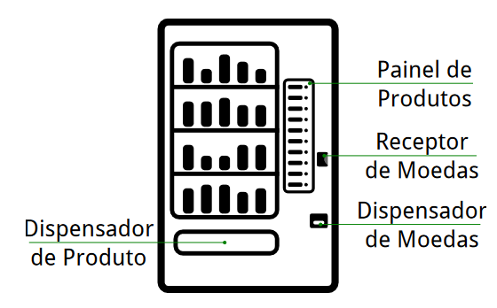
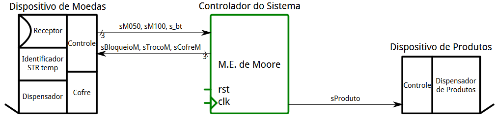
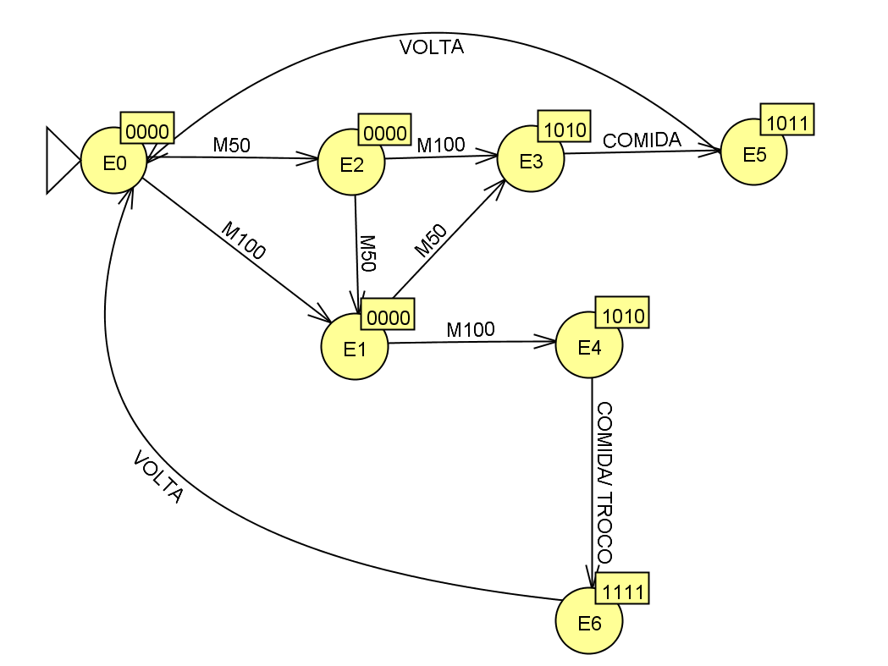

# Controlador de Máquina de Vendas

>Colaboradores: Heloisa Alves ([Github Profile](https://github.com/Helogizzy)), Ellen Bonafin ([GitHub Profile](https://github.com/EllenBonafin)) e Gabriel Mazzuco ([Github Profile](https://github.com/gabrielmazz))

## Descrição do Problema
Construir uma máquina de estado de Moore que faz o papel de um controlador de máquina de vendas simplificada.

## Sistema Geral

### Moedas aceitas/existentes:
- R$ 0,50
- R$ 1,00

### Valor do Produto:
- R$ 1,50

## Funcionamento Geral
-  Usuário deposita moedas, uma-a-uma, no Receptor de Moedas.
- Pressiona botão para escolher o único produto no Painel de Produtos.
- Obtém produto no Dispensador do Produto ou Obtém produto no Dispensador de Produto e pega o troco no Dispensador de Moedas. 

## Controlador do Sistema
- Calcula montante das moedas, uma-a-uma, até alcançar R$ 1,50 ou R$ 2,00.
- Bloqueia a entrada de novas moedas pelo Receptor de Moedas.
- Aguarda a escolha do produto.

**SE MONTANTE = R$ 1,50**

- Libera produto para Dispensador de Produto.

**SE MONTANTE = R$ 2,00**

- Libera produto para Dispensador de Produto.
- Entrega moeda R$ 0,50 como troco pelo Dispensador de Moedas.

## Módulos Internos - Diagrama Geral

## Módulos Internos - Dispositivo de Moedas

### Saída
- M50 = 1 -> uma moeda de R$ 0,50 foi inserida.
- M100 = 1 -> uma moeda de R$ 1,00 foi inserida.
- M50 e M100 nunca serão ambos 1.
- M50 e M100 em 0 (zero) indica que moeda não foi inserida.
- Botao = 1 -> botão de escolha de produto foi presisonado.

### Entradas
- Bloqueio = 0 -> Dispositivo de Moedas aceitará moedas (Receptor aberto).
- Bloqueio = 1 -> Dispositivo de Moedas não aceitará moedas (Receptor fechado).
- Troco = 0 -> Dispositivo de Moedas não entregará troco de R$ 0,50.
- Troco = 1 -> Dispositivo de Moedas entregará troco de R$ 0,50.
- Cofre = 0 -> Dispositivo de Moedas não transfere moedas de RST para o cofre.
- Cofre = 0 -> Dispositivo de Moedas transfere moedas de RST para o cofre.

### Dispositivo de Produtos
Entrada:
- Comida = 0 -> Controle não executa ação.
- Comida = 1 -> Controle libera entrega de produto.

Saída:
- Sem saída digital, apenas mecânica de produto.

### Dispositivo Controlador do Sistema
Uma máquina de Estados de Moore. 

